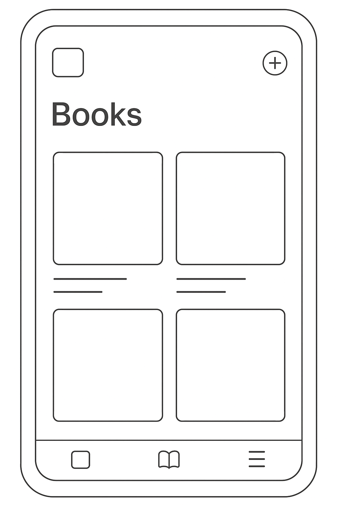

# 📖 XReader - 极简电子书阅读器

<div align="center">



一款专注于阅读体验的极简电子书阅读器

[](https://flutter.dev/)
[](https://dart.dev/)
[](LICENSE)
[](https://github.com/yourusername/xreader)

</div>

## ✨ 特性

### 🎯 设计理念
- **极简**：界面简洁，留白充足，专注阅读内容
- **沉浸**：阅读界面默认无干扰，工具栏悬浮呼出
- **柔和**：护眼配色和字体，长时间阅读不疲劳
- **一致**：图标、按钮、字体风格保持统一

### 📚 功能特性
- ✅ 支持 EPUB、PDF 格式电子书
- ✅ 极简沉浸式阅读界面
- ✅ 多种阅读主题（纸质、夜间、棕褐、护眼绿等）
- ✅ 自定义字体大小、行间距、字体系列
- ✅ 智能阅读进度保存和同步
- ✅ 书签和笔记功能
- ✅ 章节目录导航
- ✅ 阅读统计和成就系统
- ✅ 分页/滚动阅读模式切换
- ✅ 音量键翻页支持
- ✅ 夜间模式和护眼模式
- ✅ 阅读时间统计
- ✅ 书籍收藏和分类管理

### 🛠️ 技术特性
- ✅ 基于 Flutter 跨平台开发
- ✅ Riverpod 状态管理
- ✅ Isar 本地数据库
- ✅ 响应式设计适配
- ✅ 完整的错误处理机制
- ✅ 性能优化和内存管理
- ✅ 单元测试和集成测试

## 📱 截图

<div align="center">

| 书架页面 | 阅读界面 | 设置页面 |
|---------|---------|---------|
|  |  |  |

</div>

## 🚀 快速开始

### 环境要求

- Flutter 3.8.0 或更高版本
- Dart 3.0.0 或更高版本
- Android Studio 或 VS Code
- Android SDK（Android 开发）
- Xcode（iOS 开发，仅 macOS）

### 安装步骤

1. **克隆项目**
```bash
git clone https://github.com/yourusername/xreader.git
cd xreader
```

2. **安装依赖**
```bash
flutter pub get
```

3. **生成必要文件**
```bash
flutter packages pub run build_runner build
```

4. **运行应用**
```bash
# 调试模式
flutter run

# 发布模式
flutter run --release
```

### 🏗️ 构建发布版本

```bash
# 使用构建脚本（推荐）
chmod +x scripts/build_release.sh
./scripts/build_release.sh

# 或手动构建
flutter build apk --release --split-per-abi
flutter build appbundle --release
```

## 📚 项目结构

```
lib/
├── app.dart                 # 应用入口
├── main.dart               # 主函数
├── core/                   # 核心服务和配置
│   ├── constants/          # 常量定义
│   ├── themes/            # 主题配置
│   ├── utils/             # 工具类
│   └── services/          # 核心服务
│       ├── database_service.dart
│       └── file_service.dart
├── data/                   # 数据层
│   ├── models/            # 数据模型
│   ├── repositories/      # 数据仓库
│   └── datasources/       # 数据源
├── features/              # 功能模块
│   ├── bookshelf/         # 书架功能
│   │   ├── pages/
│   │   ├── widgets/
│   │   └── providers/
│   ├── reader/            # 阅读器功能
│   │   ├── pages/
│   │   ├── widgets/
│   │   ├── providers/
│   │   └── services/
│   └── settings/          # 设置功能
│       ├── pages/
│       ├── widgets/
│       └── providers/
└── shared/                # 共享组件
    ├── widgets/           # 通用Widget
    └── models/            # 共享模型
```

## 🧪 测试

```bash
# 运行所有测试
flutter test

# 运行特定测试
flutter test test/features/bookshelf/

# 运行 Widget 测试
flutter test --reporter expanded

# 生成测试覆盖率
flutter test --coverage
genhtml coverage/lcov.info -o coverage/html
```

## 📖 使用说明

### 添加书籍
1. 点击书架页面右下角的 ➕ 按钮
2. 选择"添加单个书籍"或"批量添加书籍"
3. 从文件系统中选择 EPUB 或 PDF 文件
4. 应用会自动解析书籍信息并添加到书架

### 阅读书籍
1. 在书架中点击任意书籍封面
2. 进入沉浸式阅读界面
3. 点击屏幕中央呼出/隐藏工具栏
4. 使用底部进度条快速跳转
5. 支持左右滑动翻页或音量键翻页

### 个性化设置
1. 进入设置页面
2. 在"阅读设置"中调整字体、主题等
3. 在"应用设置"中配置通知、备份等
4. 查看"阅读统计"了解阅读习惯

## 🎨 自定义主题

XReader 支持多种阅读主题：

- **纸质模式**：温和的米白色背景，适合日间阅读
- **夜间模式**：深色背景，减少蓝光，适合夜间阅读
- **棕褐模式**：复古的棕褐色调，模拟老书质感
- **护眼绿**：淡绿色背景，缓解视觉疲劳
- **清新蓝**：淡蓝色背景，清新舒适

## 🔧 开发指南

### 添加新功能

1. 在 `lib/features/` 下创建功能目录
2. 按照现有结构创建 `pages/`、`widgets/`、`providers/` 子目录
3. 使用 Riverpod 进行状态管理
4. 遵循现有的命名约定和代码风格

### 状态管理

项目使用 Riverpod 进行状态管理：

```dart
// Provider 定义
final bookshelfProvider = StateNotifierProvider<BookshelfNotifier, BookshelfState>((ref) {
  return BookshelfNotifier();
});

// 在 Widget 中使用
class BookshelfPage extends ConsumerWidget {
  @override
  Widget build(BuildContext context, WidgetRef ref) {
    final state = ref.watch(bookshelfProvider);
    // ...
  }
}
```

### 数据库操作

使用 Isar 进行本地数据存储：

```dart
// 添加书籍
await DatabaseService.addBook(book);

// 查询书籍
final books = await DatabaseService.getAllBooks();

// 更新进度
await DatabaseService.updateReadingProgress(bookId, progress);
```

## 🤝 贡献指南

我们欢迎任何形式的贡献！

### 报告问题
- 在 [Issues](https://github.com/yourusername/xreader/issues) 页面提交 Bug 报告
- 请提供详细的复现步骤和环境信息

### 提交代码
1. Fork 项目到您的 GitHub 账户
2. 创建功能分支：`git checkout -b feature/amazing-feature`
3. 提交更改：`git commit -m 'Add amazing feature'`
4. 推送分支：`git push origin feature/amazing-feature`
5. 创建 Pull Request

### 开发规范
- 遵循 [Dart Style Guide](https://dart.dev/guides/language/effective-dart/style)
- 为新功能添加单元测试
- 更新相关文档
- 保持代码简洁和注释清晰

## 📄 许可证

本项目采用 MIT 许可证。详情请查看 [LICENSE](LICENSE) 文件。

## 🙏 致谢

感谢以下开源项目的支持：

- [Flutter](https://flutter.dev/) - 跨平台移动应用开发框架
- [Riverpod](https://riverpod.dev/) - 状态管理库
- [Isar](https://isar.dev/) - 高性能本地数据库
- [epubx](https://pub.dev/packages/epubx) - EPUB 文件解析
- [google_fonts](https://pub.dev/packages/google_fonts) - Google 字体支持

## 📞 联系我们

- 📧 邮箱：support@xreader.com
- 🌐 官网：https://xreader.com
- 💬 讨论：[GitHub Discussions](https://github.com/yourusername/xreader/discussions)

---

<div align="center">

**如果这个项目对您有帮助，请给我们一个 ⭐ Star！**

Made with ❤️ by XReader Team

</div>